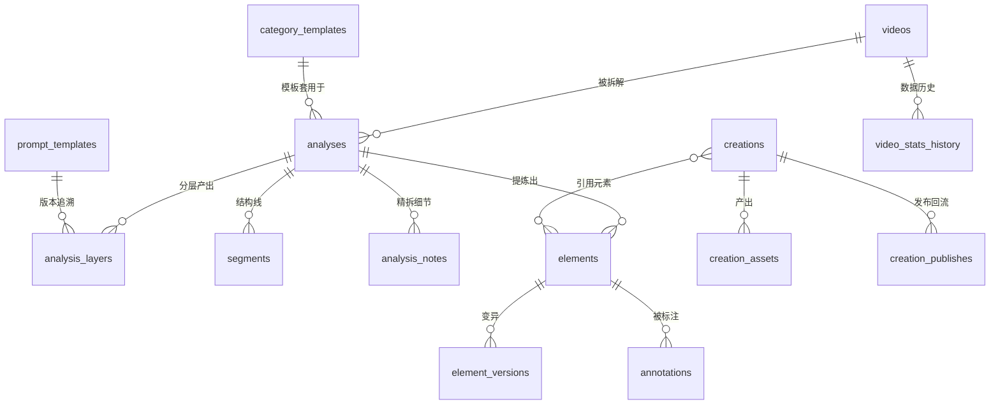

---
AIGC:
    Label: "1"
    ContentProducer: 001191440300708461136T1XGW3
    ProduceID: ce0d790a7b004233c1097246b343160b_aa414b02a81a11f18ba4525400f8a581
    ReservedCode1: M8KgpBI+VUu6RGBD1+9ZsVhjAgmujPwGKNwrA5Z+Tj8tnog45WitGcbAPefNyflSI38CPxFMMThwnaM94Gwga/hFOfs+JdUj5Y8Kvdj3Fheo329YITZksxHcGEUgwgShk3i1fQrlSsD2tvGxaPolQeqBmSw5knarY1t+KRU04WGqBNWEmQ/t9jXqWmk=
    ContentPropagator: 001191440300708461136T1XGW3
    PropagateID: ce0d790a7b004233c1097246b343160b_aa414b02a81a11f18ba4525400f8a581
    ReservedCode2: M8KgpBI+VUu6RGBD1+9ZsVhjAgmujPwGKNwrA5Z+Tj8tnog45WitGcbAPefNyflSI38CPxFMMThwnaM94Gwga/hFOfs+JdUj5Y8Kvdj3Fheo329YITZksxHcGEUgwgShk3i1fQrlSsD2tvGxaPolQeqBmSw5knarY1t+KRU04WGqBNWEmQ/t9jXqWmk=
---

# 帧间 · 数据模型设计草案 v0.3

> 状态：待评审
> 定位：以「拆解 → 标注 → 元素变异 → 创作 → 数据回流」数据飞轮为主线，整合编导 / 运营 / 拍摄 / 剪辑四岗位工作流
> 配套：docs/01-methodology.md（方法论五层） · docs/02-requirements.md · docs/03-development-log.md

---

## 0. 设计原则

1. **一视频一拆解、可多版本**：拆解结果随认知迭代，不覆盖旧版本。
2. **元素为中心**：拆解、标注、变异、创作均围绕 `elements` 关联，形成「素材 → 拆解 → 元素 → 创作 → 数据」溯源链。
3. **岗位视角打标**：每类产出标记主要受益岗位（编导 / 运营 / 拍摄 / 剪辑），便于按岗位视图过滤。
4. **观察与推断分离 + 置信度**：方法论核心约束落到字段，AI 产出一律带 `source_type`（observed / inferred）与 `confidence`。
5. **证据可回溯**：时间戳、原文案片段、截图 URL 等证据不丢弃，任何结论可点回原始位置。
6. **人工反馈可回流**：用户纠错、采纳 / 拒绝均留痕，作为质量信号参与后续拆解策略（飞轮闭环）。

---

## 1. 领域总览（6 个域，15 张表 + 2 张预留）

| 域 | 表 | 说明 |
| --- | --- | --- |
| A 账户配置 | users | 用户与账号（含多端 / 多平台身份） |
| A 账户配置 | api_keys | 各家模型 API Key（加密存储） |
| A 账户配置 | prompt_templates | 提示词模板（分层 / 分岗 / 分平台），带版本 |
| A 账户配置 | category_templates | 品类模板（结构模板 + 元素优先级 + 样例视频） |
| B 素材建档 | videos | 视频元数据（平台侧信息快照） |
| B 素材建档 | video_stats_history | 数据表现历史（播放 / 点赞 / 收藏 / 评论…） |
| C 拆解 | analyses | 一次拆解任务主记录 |
| C 拆解 | analysis_layers | 五层拆解的层级产出（JSON） |
| C 拆解 | segments | 结构线（钩子 / 铺垫 / 高潮 / CTA 等段落） |
| C 拆解 | analysis_notes | 精拆细节（逐句文案 / 镜头 / 音效 / 节奏等带时间轴条目） |
| D 元素与变异 | elements | 提炼出的元素卡片（五层通用出口） |
| D 元素与变异 | element_versions | 元素变异记录（改编历史 / 创意变体） |
| D 元素与变异 | annotations | 人工标注样本（喂给未来训练 / 校准） |
| E 创作 | creations | 创作项目主记录（来自元素组合） |
| E 创作 | creation_assets | 创作资产：选题文案 / 脚本 / 分镜 / 拍摄清单 / 剪辑指导 / 发布文案 |
| F 回流 | creation_publishes | 发布后数据回流（把「作品数据」接回飞轮） |
| — 预留 | crawl_jobs | 爬取 / 抓取任务队列（暂缓） |
| — 预留 | element_feedback | 元素在创作中被采纳 / 弃用反馈（暂缓，可由 annotations + element_versions 覆盖） |

ER 关系（节选关键链路）：

---

## 2. A 域 · 账户与配置

### 2.1 users
账号与基本资料（预留多平台身份扩展）。

| 字段 | 类型 | 说明 |
| --- | --- | --- |
| id | UUID PK | |
| display_name | text | 昵称 |
| role | text | 主职：编导 / 运营 / 拍摄 / 剪辑 / 全能（默认） |
| platforms | jsonb | 关注的发布平台（bilibili / douyin / kuaishou / xiaohongshu…） |
| created_at / updated_at | timestamptz | |

### 2.2 api_keys
各家推理 API Key，端到端加密存储。

| 字段 | 类型 | 说明 |
| --- | --- | --- |
| id | UUID PK | |
| user_id | FK→users | |
| provider | text | deepseek / openai / ollama… |
| key_encrypted | text | 加密后的 Key |
| base_url | text | 自定义网关地址（可空） |
| model_default | text | 默认模型（如 deepseek-v4-flash） |
| is_active | bool | 是否启用 |

### 2.3 prompt_templates
提示词模板：**分层 × 岗位 × 平台**，支持版本管理与 A/B。

| 字段 | 类型 | 说明 |
| --- | --- | --- |
| id | UUID PK | |
| code | text | 稳定代号（如 `layer4_content_refine`） |
| name | text | 展示名 |
| layer | int | 对应拆解层 1–5（创作类可空） |
| role_scope | text[] | 覆盖岗位：编导 / 运营 / 拍摄 / 剪辑 |
| platform_scope | text[] | 适用平台，空 = 通用 |
| content | text | 模板正文 |
| version | int | 版本号（同 code 自增） |
| status | text | active / draft / archived |
| group_key | text | A/B 分组（可空） |
| created_at | timestamptz | |

> 版本管理策略：同 `code` 多行 = 多版本，`active` 唯一，历史版本供回滚 / 对比。

### 2.4 category_templates
品类模板（对应方法论「品类模板」）：把某品类的结构套路与元素优先级固化为可复用资产。

| 字段 | 类型 | 说明 |
| --- | --- | --- |
| id | UUID PK | |
| category | text | 品类名（如 知识口播 / 剧情短剧 / 美妆测评 / 电影解说） |
| name | text | 模板名 |
| structure | jsonb | 推荐结构：段落顺序、时长占比建议 |
| element_priorities | jsonb | 该品类下元素类型优先级（钩子>节奏>…） |
| sample_video_ids | FK[]→videos | 样例视频 |
| owner_role | text | 主要适用岗位（编导常用） |
| is_active | bool | |

---

## 3. B 域 · 素材建档（外围建档）

### 3.1 videos
一条被拆解的视频主记录。

| 字段 | 类型 | 说明 |
| --- | --- | --- |
| id | UUID PK | |
| platform | text | bilibili / douyin / kuaishou / xiaohongshu |
| platform_video_id | text | 平台原生视频 ID |
| url | text | 原始链接 |
| title | text | |
| author_name / author_id | text | 作者 |
| cover_url | text | 封面 |
| duration_ms | int | 时长（毫秒） |
| publish_time | timestamptz | |
| tags | jsonb | 平台标签 |
| stats_snapshot | jsonb | 建档时数据快照（播放/点赞/收藏/评论/分享） |
| subtitle_source | text | 字幕来源：平台CC / 语音转写 / 手动上传 |
| raw_files | jsonb | 本地缓存路径：视频 / 音频 / 字幕 / 截图目录 |
| category_guess | text | 初判品类（可由 AI 回填） |
| created_at / updated_at | timestamptz | |

### 3.2 video_stats_history
数据表现时间序列（回流统计基础，运营视角核心）。

| 字段 | 类型 | 说明 |
| --- | --- | --- |
| id | UUID PK | |
| video_id | FK→videos | |
| fetched_at | timestamptz | 采集时间 |
| play_count / like_count / collect_count / share_count / comment_count / danmaku_count | bigint | 分项数据 |
| extra | jsonb | 平台附加指标（完播率等若可得） |

> 索引建议：`(video_id, fetched_at desc)`；用于画成长曲线、对比同品类标杆。

---

## 4. C 域 · 拆解

### 4.1 analyses
一次拆解任务主记录。

| 字段 | 类型 | 说明 |
| --- | --- | --- |
| id | UUID PK | |
| video_id | FK→videos | 拆哪条 |
| category_template_id | FK→category_templates | 用哪个品类模板（可空） |
| status | text | running / done / reviewed |
| current_layer | int | 进度到第几层 |
| summary | jsonb | 全局摘要（选题、主题、结论一句话） |
| ai_confidence | numeric | 整体置信度 |
| reviewed_by_user | bool | 是否已人工过目 |
| meta | jsonb | 拆解参数：模型、提示词版本、耗时 |
| created_at / updated_at | timestamptz | |

### 4.2 analysis_layers
五层拆解的每一层产出。**一层多步**，用 `step` 区分（例如第 2 层：宏观扫描分「信息架构 / 节奏起伏 / 爆点定位」多步）。

| 字段 | 类型 | 说明 |
| --- | --- | --- |
| id | UUID PK | |
| analysis_id | FK→analyses | |
| layer | int | 1 建档 / 2 宏观 / 3 结构 / 4 精拆 / 5 提炼 |
| step | text | 层内步骤名 |
| role_view | text | 该步主要产出给谁看：编导/运营/拍摄/剪辑/全员 |
| content | jsonb | 结构化产出（见各层约定） |
| source_type | text | observed / inferred（AI 结论性质） |
| confidence | numeric | 0–1 |
| model | text | 产出模型 |
| prompt_version | int | 对应 prompt_templates.version |
| raw_response | text | 原始回复（可选，便于审计） |
| created_at | timestamptz | |

各层 `content` 约定（JSON 形状草案）：

| 层 | 岗位侧重 | content 建议形状 |
| --- | --- | --- |
| 1 外围建档 | 运营 | `{topic, publish_channel, profile_lines, benchmark_group}` 等外部情报 |
| 2 宏观扫描 | 运营 + 编导 | `{info_architecture, rhythm_points[], hook_position, payoff_moments[]}` |
| 3 结构拆解 | 编导 | 段落到 `segments` 表；此处存整体 `{template_match, structure_summary}` |
| 4 内容精拆 | 拍摄 + 剪辑 + 文案 | 条目到 `analysis_notes`；此处存 `{voice_tone, style_patterns, pacing_profile}` |
| 5 元素提炼 | 全员 | 元素条目到 `elements`；此处存 `{element_summary, quality_review}` |

### 4.3 segments
结构线（第 3 层主产物）：时间轴上的段落。

| 字段 | 类型 | 说明 |
| --- | --- | --- |
| id | UUID PK | |
| analysis_id | FK→analyses | |
| seq | int | 顺序 |
| seg_type | text | 钩子 / 铺垫 / 冲突 / 转折 / 高潮 / 干货 / CTA…（可配置） |
| title | text | 段名 |
| start_ms / end_ms | int | 时间范围 |
| hook_point | bool | 是否钩子点 |
| payoff_point | bool | 是否高光/爆点 |
| emotion_curve | numeric | 情绪强度 0–10 |
| summary | text | 段落作用一句话 |
| role_view | text | 主要观察岗位（如 剪辑看节奏、编导看结构） |
| created_at | timestamptz | |

### 4.4 analysis_notes
精拆细节（第 4 层主产物）：一条 = 时间轴上的一条具体观察。

| 字段 | 类型 | 说明 |
| --- | --- | --- |
| id | UUID PK | |
| analysis_id | FK→analyses | |
| segment_id | FK→segments | 可空（可先于分段存在） |
| note_type | text | transcript（逐句文案）/ shot（镜头）/ audio（声音/配乐/音效）/ text_overlay（字幕花字）/ rhythm（节奏卡点）/ frame（静帧） |
| start_ms / end_ms | int | |
| role_view | text | 拍摄（画面）/ 剪辑（节奏卡点）/ 文案（话术）… |
| content | text | 具体内容 |
| attachment_url | text | 截图 / 片段路径 |
| confidence | numeric | |

> 多岗位价值：运营看话术钩子（transcript），拍摄看运镜构图（shot），剪辑看卡点转场（rhythm）。

---

## 5. D 域 · 元素与变异（知识层，飞轮心脏）

### 5.1 elements
元素卡片：来自第 5 层提炼 / 人工标注 / 跨片归纳。**一切创作变异的原料**。

| 字段 | 类型 | 说明 |
| --- | --- | --- |
| id | UUID PK | |
| analysis_id | FK→analyses | 来源拆解（人工创建可空） |
| category | text | 元素类型：选题 / 钩子 / 结构 / 话术 / 情绪 / 视觉 / 剪辑手法 / 声音设计 / 运营策略… |
| name | text | 元素名（如「反常识数据钩子」） |
| description | text | 内涵描述 |
| formula | text | 可复述的「配方」（如：开场 3s 抛反常识数字 + 停顿 1s） |
| source_type | text | observed / inferred / manual |
| confidence | numeric | |
| role_view | text | 该元素主要服务岗位 |
| evidence | jsonb | 证据链：[{analysis_id, seg, note_id, time, quote}] |
| status | text | draft / accepted / adjusted / rejected（质量自循环） |
| tags | text[] | 标签 |
| created_at / updated_at | timestamptz | |

### 5.2 element_versions
变异记录：元素被改编 / 换壳 / 组合的每一次变化（对应「元素变异」环节）。

| 字段 | 类型 | 说明 |
| --- | --- | --- |
| id | UUID PK | |
| element_id | FK→elements | 源自哪个元素 |
| version_seq | int | 变异序号 |
| change_kind | text | 换场景 / 换对象 / 换话术 / 跨平台适配 / 组合 |
| new_formula | text | 变异后的配方 |
| used_by_creation_id | FK→creations | 被哪个创作引用（可空） |
| note | text | 变异思路 |
| created_at | timestamptz | |

### 5.3 annotations
人工标注样本（AI 之外的眼睛）：用于校准元素、未来微调。

| 字段 | 类型 | 说明 |
| --- | --- | --- |
| id | UUID PK | |
| video_id / analysis_id | FK | 标注对象 |
| annotator_id | FK→users | 谁标的 |
| element_category | text | |
| value | text | 标注内容 |
| start_ms / end_ms | int | 位置 |
| source | text | 手动 / 采纳AI建议后修正 |
| created_at | timestamptz | |

---

## 6. E 域 · 创作（E）

### 6.1 creations
一次创作项目主记录：从元素组合出发。

| 字段 | 类型 | 说明 |
| --- | --- | --- |
| id | UUID PK | |
| user_id | FK→users | |
| title | text | 选题 / 项目名 |
| platform | text | 目标平台 |
| intent | text | 创作目标（涨粉 / 带货 / 品牌曝光…） |
| core_elements | jsonb | 引用的元素及组合方式（[{element_id, role, order}]） |
| status | text | idea / drafting / produced / published / archived |
| ref_video_ids | FK[]→videos | 参考对标（可空） |
| created_at / updated_at | timestamptz | |

### 6.2 creation_assets
创作资产：**多岗位的中间与最终产物**。

| 字段 | 类型 | 说明 |
| --- | --- | --- |
| id | UUID PK | |
| creation_id | FK→creations | |
| asset_type | text | topic_plan（选题策划）/ script（脚本）/ shot_list（分镜/拍摄清单）/ shooting_guide（拍摄指导）/ edit_guide（剪辑指导）/ title_options（标题选项）/ publish_copy（发布文案）/ thumbnail_idea（封面建议） |
| role_view | text | 对应岗位（编导出脚本、拍摄看分镜、剪辑看节奏指导、运营看发布文案） |
| content | jsonb / text | 内容（结构化或长文） |
| parent_id | FK→creation_assets | 上级资产（如 分镜属于某个脚本段落） |
| ai_generated | bool | 是否 AI 生成待人工确认 |
| created_at / updated_at | timestamptz | |

### 6.3 creation_publishes
发布与回流：作品上线后的数据接回系统。

| 字段 | 类型 | 说明 |
| --- | --- | --- |
| id | UUID PK | |
| creation_id | FK→creations | |
| publish_platform | text | 发在哪个平台 |
| publish_url | text | |
| published_at | timestamptz | |
| stats | jsonb | 数据快照 |
| stats_fetched_at | timestamptz | 最近抓取时间 |

---

## 7. 岗位整合对照（评审自检）

| 岗位 | 主要用到的表 / 产出 | 系统里为他们做了什么 |
| --- | --- | --- |
| 编导 | segments、elements、analysis_layers(3/5)、creations.script、category_templates | 结构模板 + 元素组合成选题脚本 |
| 运营 | videos、video_stats_history、elements(运营策略类)、creation_assets.publish_copy | 数据对比、爆款规律、发布文案标题 |
| 拍摄 | analysis_notes(shot)、creation_assets.shot_list / shooting_guide | 对标镜头语言 → 可执行拍摄清单 |
| 剪辑 | analysis_notes(rhythm/frame/audio)、creation_assets.edit_guide | 卡点节奏 / 转场手法拆解 → 剪辑指导 |

---

## 8. 待办 / 未决问题

- [ ] ER 图是否需要 `element_feedback` 表（暂由 annotations + element_versions 承担）
- [ ] 字幕 / 音频转写文件存储位置（本地 vs 对象存储）与 `raw_files` 约定
- [ ] analyses 多版本策略：同视频多次拆解时，是否开多条 analyses 还是升版本
- [ ] 平台指标字段是否按平台拆成 `extra` 内部命名规范
- [ ] API Key 加密方案落库细节（由后端引入时定）
*（内容由AI生成，仅供参考）*
